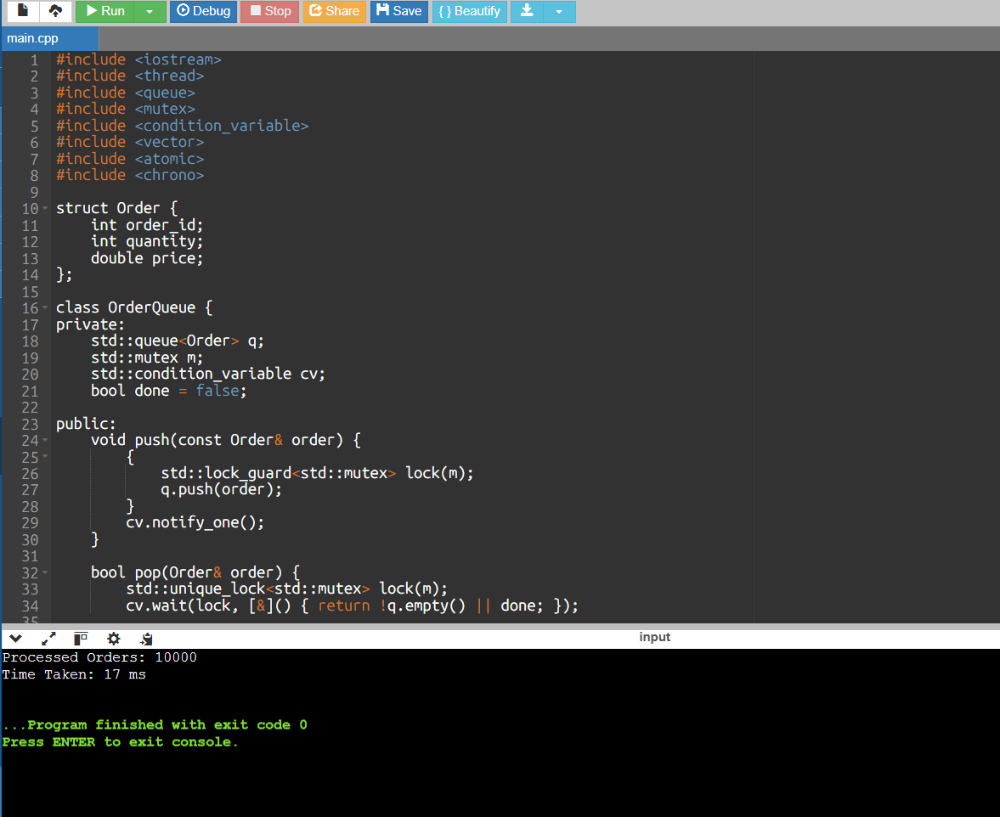

# Multithreaded Order Processing System in C++

This project implements a **multithreaded order processing system** in C++ using a classic **producer–consumer architecture**.  
The goal is to understand how concurrent systems handle work distribution, synchronization, and throughput using multiple threads.

---

## 🚀 Project Overview

The system simulates a real-world backend processing pipeline where:

- Orders are generated by a producer thread
- Orders are stored in a shared thread-safe queue
- Multiple worker threads consume and process orders concurrently

The design focuses on **correctness, scalability, and efficient CPU usage** rather than ultra-low latency.

---

## 🏗️ System Architecture

Order Producer
↓
Thread-Safe Queue
↓
Worker Thread Pool


- The producer continuously generates orders
- Worker threads process orders in parallel
- Processing stops gracefully once all orders are handled

---

## 🛠️ Tech Stack

- **Language:** C++17
- **Concurrency:** `std::thread`
- **Synchronization:** `std::mutex`, `std::condition_variable`, `std::atomic`
- **Data Structures:** STL `queue`
- **Timing:** `std::chrono`

---

## 🧪 Processing Design

- A single producer thread generates a fixed number of orders
- A configurable number of worker threads process orders concurrently
- The queue blocks worker threads using a condition variable when no work is available
- A clean shutdown mechanism ensures workers exit safely after all orders are processed

This design avoids busy-waiting and prioritizes **throughput and CPU efficiency**.

---

## 📊 Sample Output

Example output from a local run:




> Execution time varies depending on hardware, number of worker threads,
> and system load.

---

## 🧠 Key Learnings

- Producer–consumer concurrency patterns
- Thread-safe queue implementation using mutexes and condition variables
- Coordinating multiple worker threads safely
- Blocking vs spinning trade-offs in concurrent systems
- Measuring throughput in multithreaded applications

---

## ⚠️ Design Notes

- This project is **throughput-oriented**, not optimized for ultra-low latency
- Blocking synchronization is intentionally used to reduce CPU waste
- For latency-sensitive workloads, a lock-free or spinning design may be more appropriate

This project complements a low-latency queue implementation by showcasing
a different concurrency strategy.

---

## 📎 Build & Run

Compile with optimizations enabled:

```bash
g++ -O2 -std=c++17 main.cpp -pthread
./a.out


Processed Orders: 10000
Time Taken: 17 ms
